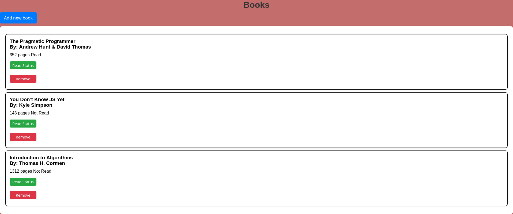

# Library Management App

## Overview

Simple library management application that allows to add, view, and manage books. 
You can input details such as the book title, author, number of pages, and whether they have read the book.

[Live Preview](https://mx-99.github.io/library).

 

## Features

- **Add New Books**: You can input details for new books through a dialog form.
- **Display Books**: All added books are displayed showing their title, author, number of pages, and read status.
- **Toggle Read Status**: You can mark books as read or not read.
- **Remove Books**: You can remove books from the library.

